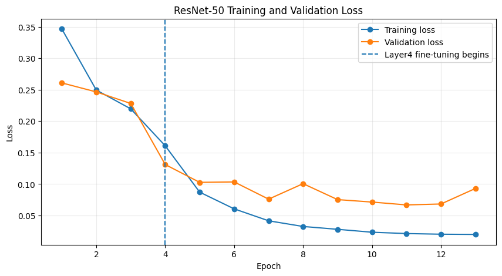
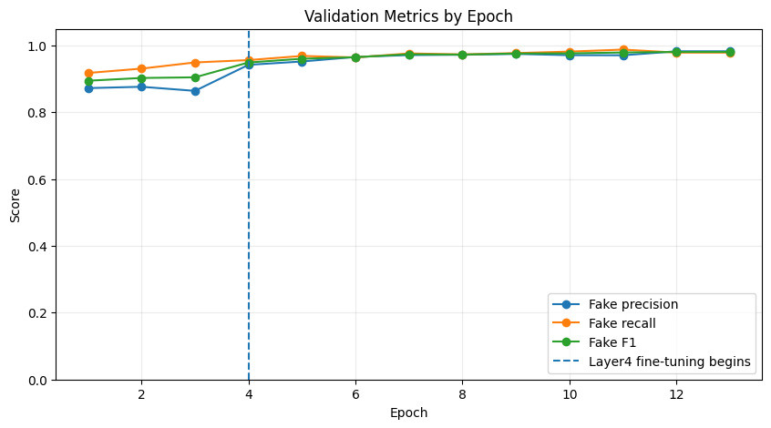
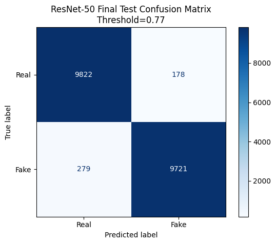
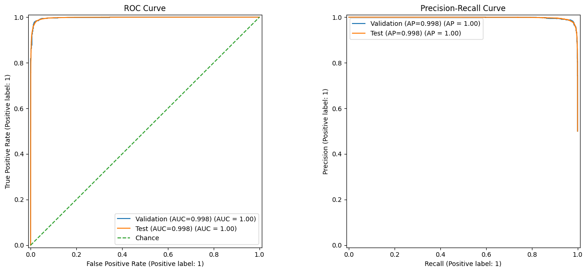

# Deepfake Detection Project

**Working Name:** Synthetic Sight  
**AI4ALL Team 9C**

## 1. Project Overview & Problem Statement
With the rapid advancement of generative AI models, synthetic imagery has become increasingly realistic and accessible. The goal of **Synthetic Sight** is to develop a robust binary image classification pipeline capable of distinguishing between real human faces and AI-generated synthetic faces. This project focuses on evaluating deep learning architectures (specifically ResNet-50) and auditing datasets for potential demographic and data biases.

## 2. Dataset Information
We used the **140k Real and Fake Faces Kaggle Dataset**:
* **Real Images (70,000):** Sourced from NVIDIA’s Flickr-Faces-HQ (FFHQ) dataset.
* **Fake Images (70,000):** Sampled from 1 Million StyleGAN-generated synthetic faces.
* **Pre-processing:** All images are normalized and resized to 224 × 224 pixels for ResNet-50 across training, validation, and test splits.

## 3. Project Structure
```plaintext
deepfake-detection/
├── assets/                 # Visualizations, diagrams, and evaluation plots
├── data/                   # Data README and setup instructions
├── deployment/
│   └── streamlit/          # Streamlit web application code
├── docs/                   # References and project documentation
├── models/                 # Saved model weights and checkpoints
├── notebooks/              # Core project notebooks
│   ├── deepfake_detector.ipynb        # Exploratory data analysis & baseline setup
│   ├── resnet50_training.ipynb        # ResNet-50 model training & evaluation
│   └── data_bias_audit.ipynb          # Demographic and dataset bias evaluation
├── PROJECT_SCOPE.ipynb     # Initial project scope and plan
├── README.md               # Main repository documentation
└── requirements.txt        # Dependencies required to run the project

```

## 4. Methodology & Model Architecture
- **Data Sampling & Augmentation:** Balanced samples of real and fake images are loaded, normalized using ImageNet mean/std statistics, and fed through PyTorch DataLoader pipelines.

- **Model Selection (ResNet-50):** We fine-tune a pre-trained ResNet-50 model for binary classification (0 = Real, 1 = Fake).

* **Two-Stage Training Strategy:**
  - **Stage 1 (Head-Only):** Trains only the new classifier head while keeping     the ResNet-50 backbone frozen.
  - **Stage 2 (Fine-Tuning):** Unfreezes and fine-tunes `layer4` alongside the classifier head with early stopping based on validation score.
  
- **Data Bias Audit:** We conducted fairness and distribution checks in data_bias_audit.ipynb to evaluate model predictions across variations in lighting, background artifacts, and demographic representation.

## 5. Results & Evaluation

### Evaluation Plots

| Loss & Accuracy Curves | Validation Metrics |
| :---: | :---: |
|  |  |

| Final Test Confusion Matrix | ROC & Precision-Recall Curves |
| :---: | :---: |
|  |  |

## 6. Setup & Reproducibility Guide

**Option A: Running the Notebook in Google Colab**
- Open resnet50_training.ipynb in Google Colab.
- Set your runtime to GPU (Runtime > Change runtime type > T4 GPU).
- Add your Kaggle API token to Colab Secrets as KAGGLE_API_TOKEN.
- Run all cells top-to-bottom (Runtime > Restart session and run all).

**Option B: Running Streamlit Locally**
* **Clone the repository:**
```bash
git clone [https://github.com/Shloka-16/deepfake-detection.git](https://github.com/Shloka-16/deepfake-detection.git)
cd deepfake-detection
```

* **Install dependencies:**

```bash
pip install -r requirements.txt

```

* **Launch the web application:**

```bash
streamlit run deployment/streamlit/app.py

```

## 7. Ethical Considerations & Limitations

Deepfake and synthetic face technologies introduce significant privacy, security, and trust risks. Synthetic Sight is explicitly intended for research and defensive detection use cases (e.g., understanding vulnerabilities, building detection tools), and must not be used to create, disseminate, or legitimize harmful synthetic media.

**1. Misuse and privacy risks**

Deepfake content can be weaponized for harassment, impersonation, fraud, and non‑consensual imagery. This project should never be used to assist in producing or spreading such content. Any real‑world deployment of this model must comply with applicable privacy, data protection, and digital safety regulations and include clear disclosure to affected users.

**2. Dataset and model biases**

The Kaggle dataset combines FFHQ and StyleGAN‑generated faces, both of which may under‑represent certain demographic groups (e.g., age ranges, skin tones, cultural backgrounds), and over‑represent others. As a result, model performance may vary across demographics and visual conditions (lighting, background, accessories), and high accuracy on aggregate metrics does not guarantee fairness for everyone. Our data bias audit notebook (data_bias_audit.ipynb) should be used to periodically evaluate and document performance differences across subgroups, and any gaps should be clearly disclosed rather than hidden.

**3. Limitations of scope and generalization**

The current model is trained only on cropped human face images from a specific Kaggle dataset and evaluated within that distribution. It may not generalize reliably to other domains such as full‑body deepfakes, video sequences, non‑human subjects, or images generated by newer models not represented in the training data. Predictions should be treated as probabilistic signals, not ground truth; manual review and complementary checks are recommended in any high‑stakes setting.

**4. Responsible deployment guidelines**

Avoid deploying this model as a fully automated decision system in high‑impact contexts (e.g., content takedowns, legal processes) without human oversight and documented procedures for appeals and error handling. 
Include transparency notes for users (what data the model was trained on, where it is likely to fail, and how predictions should be interpreted). Regularly retrain or re‑evaluate the model as generative techniques evolve to avoid a false sense of security from stale performance metrics. By explicitly documenting these ethical considerations and technical limitations, we aim to encourage responsible research, highlight fairness concerns, and reduce the likelihood of harmful or misleading use of Synthetic Sight.

## 8. Team Contributions

* **Team 9C (Synthetic Sight):** Collaborative work on model training pipelines, data preprocessing, bias auditing, web app deployment, and documentation.

